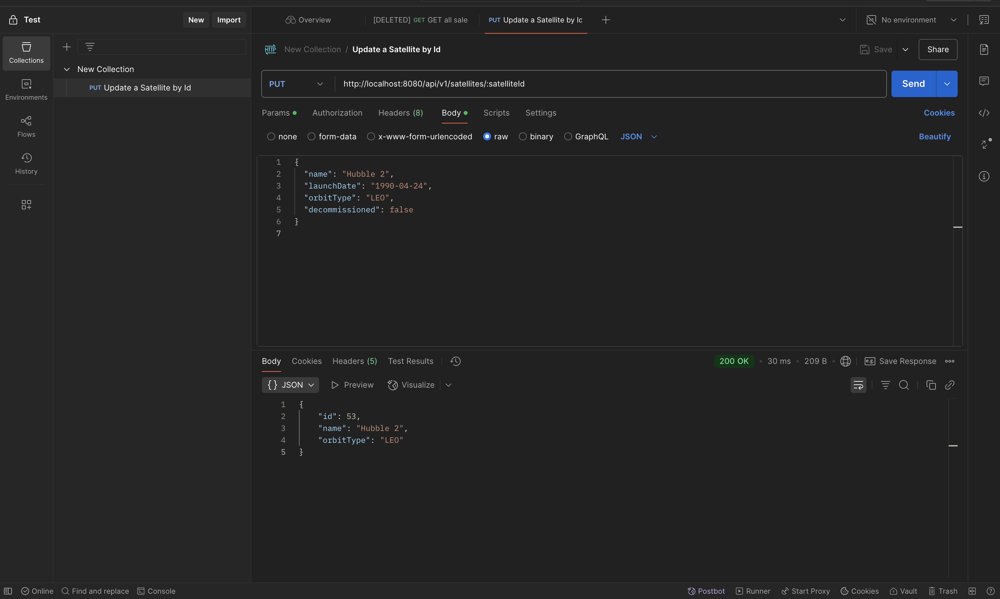
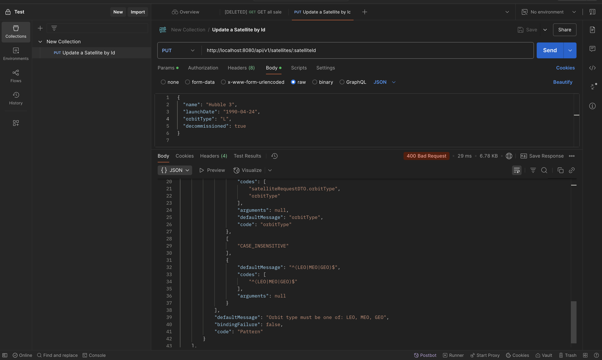
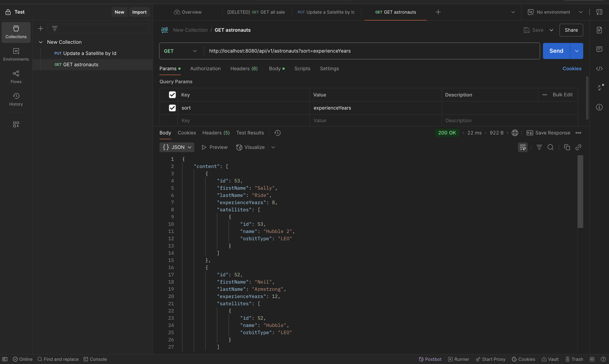
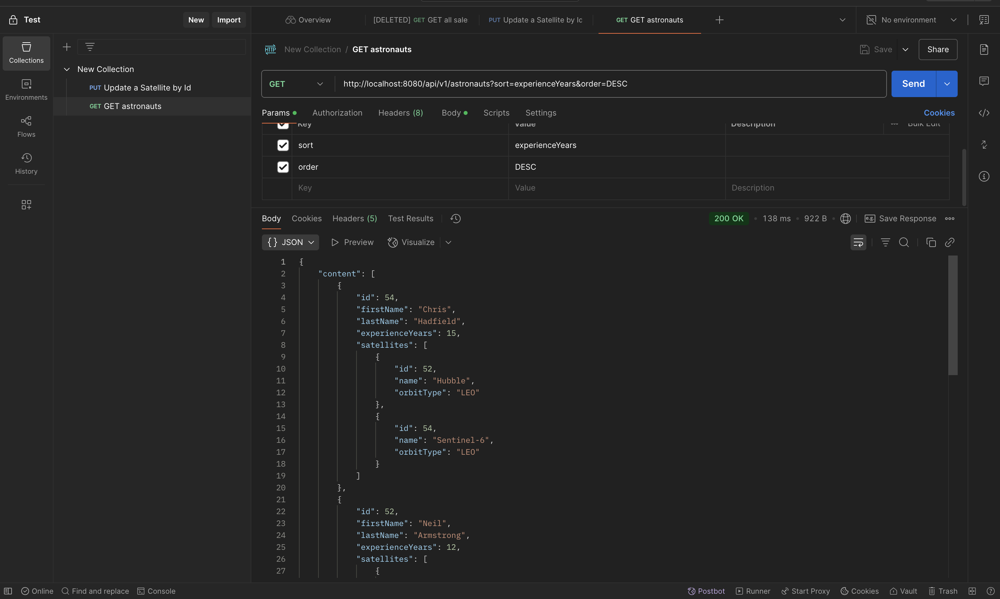

Screenshots

## 1. PUT /api/v1/satellites/:satelliteId Requests

### 1.1 PUT success request

### 1.2 PUT bad request for orbitType using regex

## 2 GET /api/v1/astronauts?sort=experienceYears requests

## 2.1 Implicit ASC order

## 2.2 DESC order using order property

