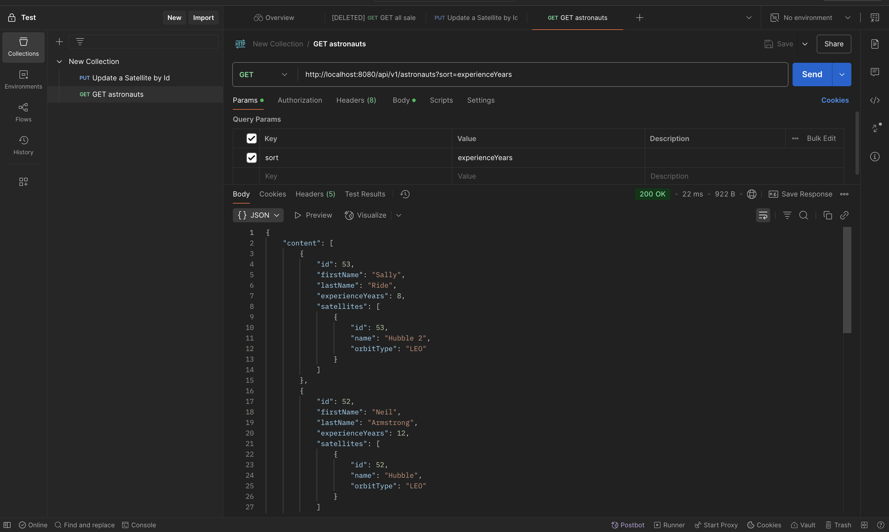
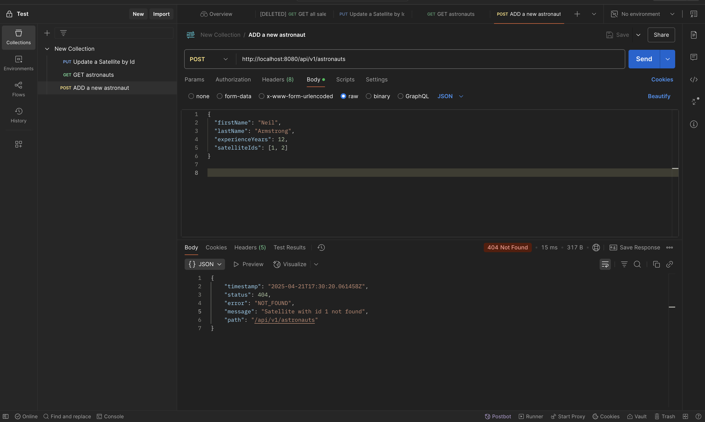
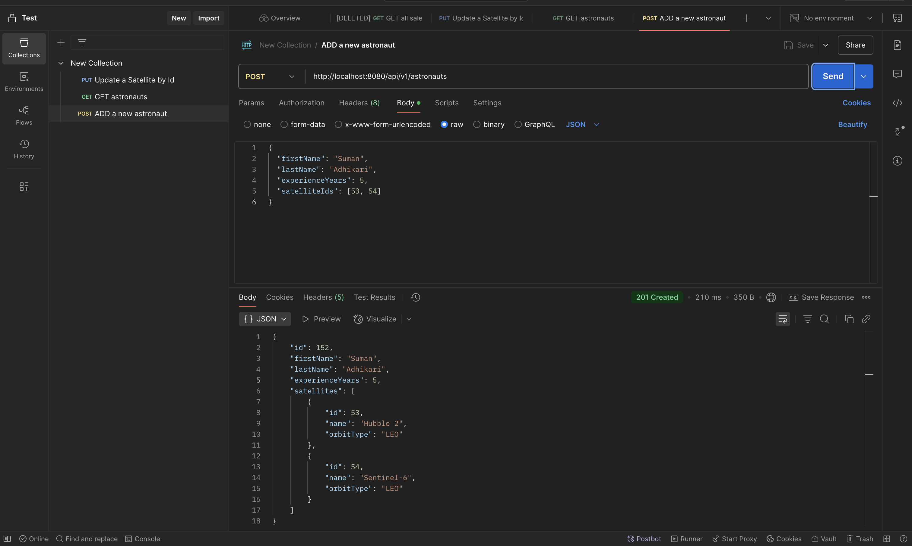
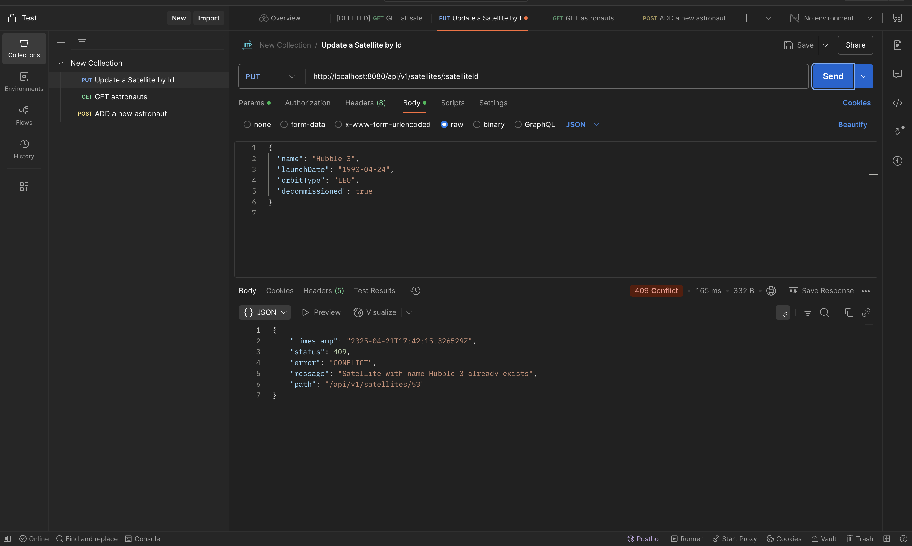
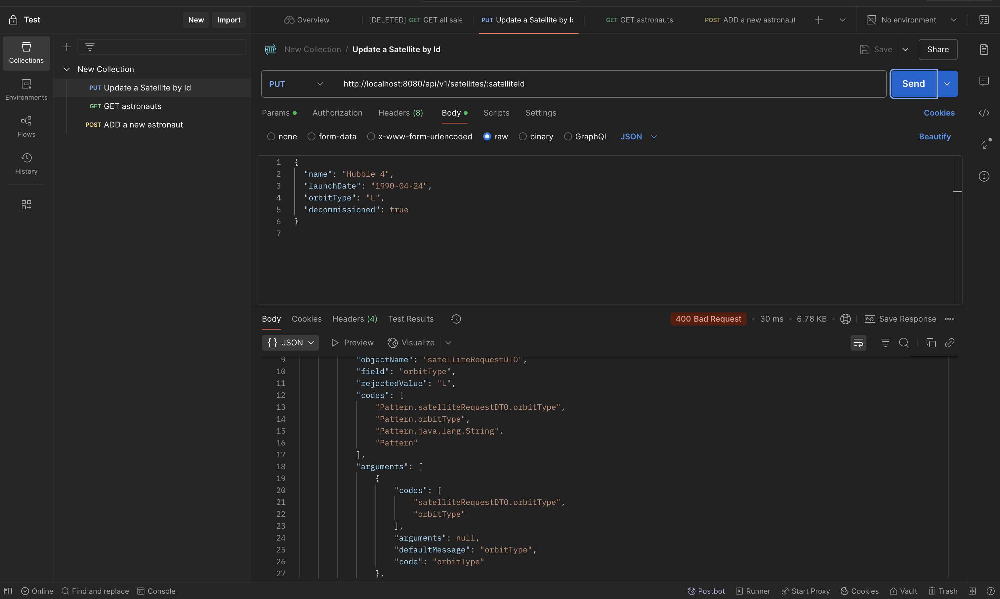
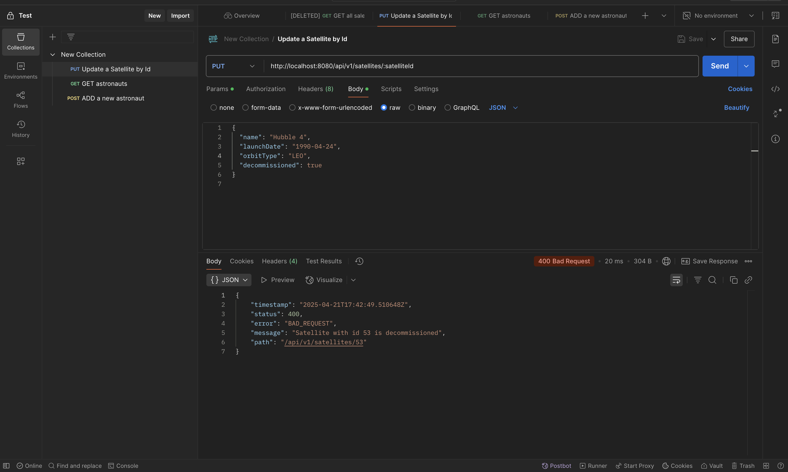
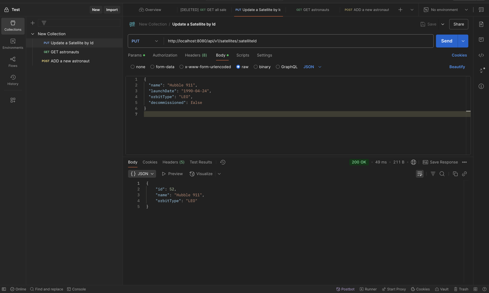

# Screenshots

## 1 GET /api/v1/astronauts?sort=experienceYears requests

## 1.1 Implicit ASC order

## 1.2 DESC order using order property

---

## 2. POST /api/v1/astronauts requests

### 2.1 Satellite not found

### 2.2 Satellite found, successfully saved

---
## 3. PUT /api/v1/satellites/:satelliteId Requests

### 3.1 Duplicate satelite name error

### 3.2 OrbitType pattern not matched

### 3.3 Satelite is already decommisioned, cannot updated

## 3.4 Satelite is updated successfully

